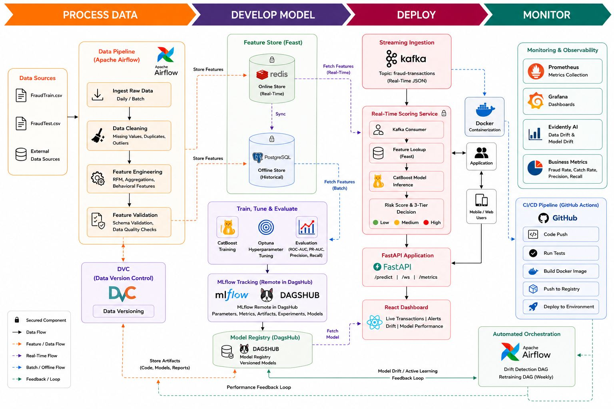

# Real-Time Fraud Detection — Sparkov + CatBoost + Feast + Kafka

[](https://github.com/NullBitZer0/real-time-fraud-detection/actions/workflows/ci.yml)
[](https://dagshub.com/NullBitZer0/real-time-fraud-detection.mlflow)
[](https://www.python.org/)
[](https://vitejs.dev/)

End-to-end production-grade real-time fraud-detection system. It processes credit card transaction streams using **Kafka (KRaft)**, performs low-latency feature lookups using **Feast** (with **PostgreSQL** as the offline historical store and **Redis** as the online store), and evaluates transactions using a **CatBoost** classifier with a custom **3-tier action framework**.

All configurations are managed through `params.yaml`. System orchestration is handled via **Apache Airflow**, experiment tracking via **DAGsHub MLflow**, and deployment is automated through **GitHub Actions CI/CD** with **Coolify**.

---

## Live Demo

| Service | URL |
| :--- | :--- |
| Dashboard | [dashboard.adeeshaperera.me](https://dashboard.adeeshaperera.me) |
| Grafana | [grafana.adeeshaperera.me](https://grafana.adeeshaperera.me) |
| Airflow | [airflow.adeeshaperera.me](https://airflow.adeeshaperera.me) (Viewer: `viewer` / `viewer`) |
| API Docs | [dashboard.adeeshaperera.me/docs](https://dashboard.adeeshaperera.me/docs) |

---

## Architecture Diagram



---

## How It Works

### Prediction Flow
1. Transaction arrives via REST API or Kafka stream
2. **Feast** fetches real-time features from **Redis** (velocity counts, merchant stats)
3. **CatBoost** model scores fraud probability
4. **3-tier framework** decides action: approve / soft_signal / review_queue / auto_block
5. Result logged to **PostgreSQL** audit log + broadcast via **WebSocket** to dashboard

### Model Lifecycle
```
train → register (Staging) → evaluate → metric gate (PR-AUC ≥ 0.78) → auto-promote (Production)
                                                                                    ↓
                                                              CD downloads → Docker image → Coolify deploys
```

- **Training**: `pipelines/training_pipeline.py` or Airflow `fraud_retraining` DAG
- **Registry**: MLflow on DAGsHub (`FraudDetectionCatBoost`)
- **Deployment**: Model downloaded from MLflow at container startup (not baked into image)
- **Safety**: Smoke test in CI validates model before Docker build

---

## CI/CD Pipeline

```
push to main → CI (lint, typecheck, tests, Docker build check)
                    ↓
              CD (download model → smoke test → Docker build → merge main→production)
                                                                      ↓
                                                              Coolify deploys from production
```

**Branches:**
- `main` — development, CI runs on every push
- `production` — deployed by Coolify, only updated after CI passes

---

## Retraining & Ingestion Architecture

Pipeline orchestration uses **Apache Airflow** DAGs under `airflow/dags/`. DVC is used **exclusively for data versioning** of raw CSV files.

### Orchestration DAGs

| DAG ID | Schedule | Description |
| :--- | :--- | :--- |
| `fraud_retraining` | `0 0 * * 1` (Monday) | Pulls data, seeds Feast, trains CatBoost, metric gate, auto-promotes to Production via MLflow |
| `fraud_drift_check` | `0 6 * * *` (Daily) | Generates Evidently drift report, triggers `fraud_retraining` if ≥ 5 features drifted |
| `fraud_optuna_monthly` | `0 0 1 * *` (Monthly) | Optuna hyperparameter tuning |

---

## Getting Started

### Complete One-Command Demo Launch
Bring up all services (Ingest, Feast, Kafka, ML, APIs, Dashboard):
```bash
bash scripts/demo.sh
```

### Manual Component Initialization

```bash
# 1. Start all infrastructure services
docker compose up -d postgres redis kafka prometheus grafana

# 2. Seed Feast offline (PostgreSQL) and online (Redis) databases
python feast/seed.py

# 3. Start Apache Airflow orchestrator
docker compose up -d airflow-postgres airflow-init airflow-webserver airflow-scheduler

# 4. Run the API scorer (port 8888)
python -m uvicorn api.app:app --host 0.0.0.0 --port 8888

# 5. Run Vite React application
cd frontend && npm install && npm run dev
```

To shut down everything: `bash scripts/demo-stop.sh`

---

## Production Deployment (Coolify)

### Environment Variables (set in Coolify)
| Variable | Description |
| :--- | :--- |
| `DAGSHUB_TOKEN` | DAGsHub personal access token |
| `DAGSHUB_REPO_OWNER` | `NullBitZer0` |
| `DAGSHUB_REPO_NAME` | `real-time-fraud-detection` |
| `MLFLOW_TRACKING_URI` | `https://dagshub.com/NullBitZer0/real-time-fraud-detection.mlflow` |

### What Happens at Startup
1. `entrypoint.sh` runs
2. Model downloaded from MLflow if `models/catboost.cbm` missing
3. `fraudTest.csv` pulled from DVC if missing
4. Uvicorn starts API on port 8888

---

## Observability

### Local Development
| Service | URL |
| :--- | :--- |
| React Dashboard | [http://localhost:3000](http://localhost:3000) |
| FastAPI Docs | [http://localhost:8888/docs](http://localhost:8888/docs) |
| Airflow | [http://localhost:8081](http://localhost:8081) (`admin` / `admin`) |
| Grafana | [http://localhost:3001](http://localhost:3001) |
| Prometheus | [http://localhost:9090](http://localhost:9090) |

### Production (Coolify)
| Service | URL |
| :--- | :--- |
| Dashboard | [dashboard.adeeshaperera.me](https://dashboard.adeeshaperera.me) |
| Grafana | [grafana.adeeshaperera.me](https://grafana.adeeshaperera.me) |
| Airflow | [airflow.adeeshaperera.me](https://airflow.adeeshaperera.me) |

---

## 3-Tier Decision Actions

The prediction pipeline scores transaction records and flags them according to probability thresholds defined in `params.yaml`:

| Tier | Probability Bounds | System Action | Action Details |
| :---: | :--- | :--- | :--- |
| **0** | `p < 0.0040` | `approve` | Low risk: automatically processed |
| **3** | `0.0040 <= p < 0.1198` | `soft_signal` | Moderate risk: processed, flagged for auditing |
| **2** | `0.1198 <= p < 0.5613` | `review_queue` | High risk: forwarded to manual review |
| **1** | `p >= 0.5613` | `auto_block` | Critical risk: transaction declined |

---

## Tech Stack

| Category | Technology |
| :--- | :--- |
| **Model** | CatBoost (tuned via Optuna) |
| **Feature Store** | Feast (PostgreSQL offline + Redis online) |
| **Streaming** | Apache Kafka (KRaft mode) |
| **Orchestration** | Apache Airflow |
| **Experiment Tracking** | MLflow on DAGsHub |
| **Data Versioning** | DVC (DAGsHub S3) |
| **API** | FastAPI + WebSocket |
| **Dashboard** | React (Vite) |
| **Monitoring** | Prometheus + Grafana + cAdvisor + node-exporter |
| **CI/CD** | GitHub Actions |
| **Deployment** | Coolify (Docker Compose) |
| **Drift Detection** | Evidently |

---

## Project Layout

```
.
├── api/                    # FastAPI microservice (predictions, WebSocket, metrics)
├── airflow/                # Airflow DAGs and Dockerfile
├── data/
│   └── raw/                # Raw CSV records + DVC tracking files
├── feast/                  # Feast Feature Store definitions
├── frontend/               # React (Vite) dashboard
├── kf/                     # Kafka producers and consumers
├── monitoring/             # Prometheus config, Grafana dashboards
├── pipelines/
│   ├── training_pipeline.py    # ML training (Feast → CatBoost → MLflow)
│   └── prediction_pipeline.py  # Real-time inference pipeline
├── scripts/                # Startup, shutdown, model download utilities
├── src/                    # Source package (features, validation, components)
├── tests/                  # Integration and parity tests
├── docker-compose.yml      # Single compose file for all services
├── Dockerfile              # Multi-stage: Node build → Python API + dashboard
├── params.yaml             # Single-point parameter configuration
└── requirements.txt        # Python dependencies
```

---

## Common Tasks

### Trigger Model Retraining
```bash
curl -X POST https://airflow.adeeshaperera.me/api/v1/dags/fraud_retraining/dagRuns \
  -H "Content-Type: application/json" \
  -u viewer:viewer \
  -d '{"conf": {"trigger_source": "manual"}}'
```

### Run Standalone Training
```bash
python -m pipelines.training_pipeline
```

### Trigger Drift Check
```bash
curl -X POST https://airflow.adeeshaperera.me/api/v1/dags/fraud_drift_check/dagRuns \
  -H "Content-Type: application/json" \
  -u viewer:viewer \
  -d '{}'
```

### Re-Apply Feast Schema
```bash
cd feast/feature_repo
feast apply
feast materialize "2019-01-01" "2021-01-01"
```

### Check API Health
```bash
curl https://dashboard.adeeshaperera.me/health
```
